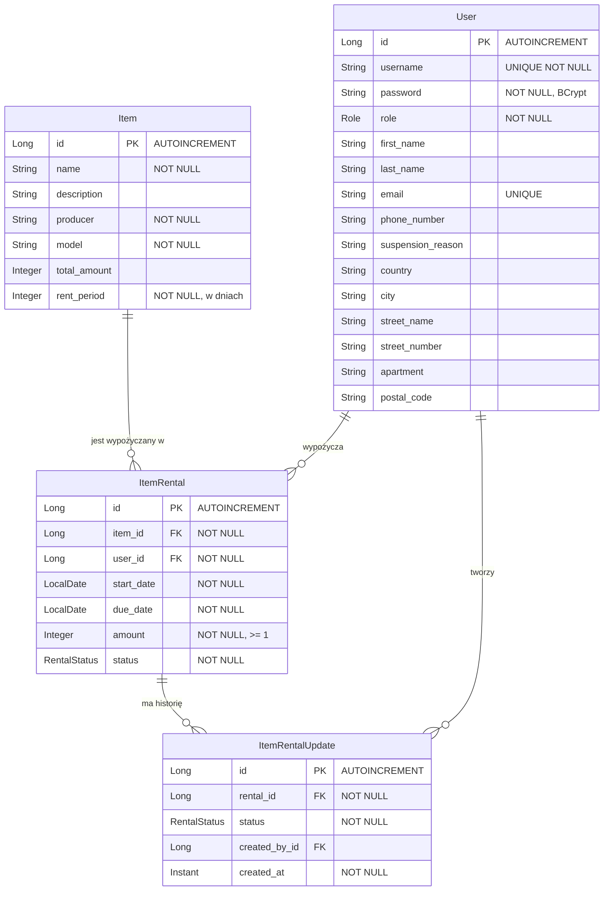

# Diagram encji (ER)

```mermaid
erDiagram
    User {
        Long id PK "AUTOINCREMENT"
        String username "UNIQUE NOT NULL"
        String password "NOT NULL, BCrypt"
        Role role "NOT NULL"
        String first_name
        String last_name
        String email "UNIQUE"
        String phone_number
        String suspension_reason
        String country
        String city
        String street_name
        String street_number
        String apartment
        String postal_code
    }

    Item {
        Long id PK "AUTOINCREMENT"
        String name "NOT NULL"
        String description
        String producer "NOT NULL"
        String model "NOT NULL"
        Integer total_amount
        Integer rent_period "NOT NULL, w dniach"
    }

    ItemRental {
        Long id PK "AUTOINCREMENT"
        Long item_id FK "NOT NULL"
        Long user_id FK "NOT NULL"
        LocalDate start_date "NOT NULL"
        LocalDate due_date "NOT NULL"
        Integer amount "NOT NULL, >= 1"
        RentalStatus status "NOT NULL"
    }

    ItemRentalUpdate {
        Long id PK "AUTOINCREMENT"
        Long rental_id FK "NOT NULL"
        RentalStatus status "NOT NULL"
        Long created_by_id FK
        Instant created_at "NOT NULL"
    }

    Item ||--o{ ItemRental : "jest wypożyczany w"
    User ||--o{ ItemRental : "wypożycza"
    ItemRental ||--o{ ItemRentalUpdate : "ma historię"
    User ||--o{ ItemRentalUpdate : "tworzy"
```