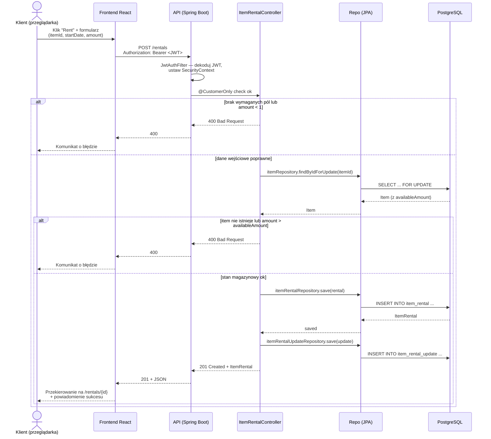

# Diagram sekwencji — Wypożyczenie narzędzia

Scenariusz: zalogowany klient klika *Rent* na stronie szczegółów narzędzia,
podaje datę i liczbę sztuk, a aplikacja zapisuje wypożyczenie w bazie i zwraca
potwierdzenie.

