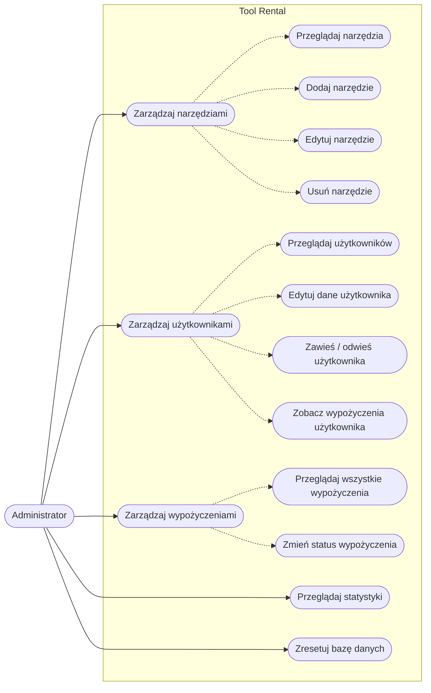

# Administrator

```mermaid
flowchart LR
    admin([Administrator])

    subgraph System["Tool Rental"]
        item_manage([Zarządzaj narzędziami])
        user_manage(["Zarządzaj użytkownikami"])
        rental_manage(["Zarządzaj wypożyczeniami"])
        
        items_browse([Przeglądaj narzędzia])
        item_create([Dodaj narzędzie])
        item_edit([Edytuj narzędzie])
        item_delete([Usuń narzędzie])

        users_list([Przeglądaj użytkowników])
        user_edit([Edytuj dane użytkownika])
        user_suspend([Zawieś / odwieś użytkownika])
        user_rentals([Zobacz wypożyczenia użytkownika])

        rentals_all([Przeglądaj wszystkie wypożyczenia])
        rental_status([Zmień status wypożyczenia])

        stats([Przeglądaj statystyki])
        db_reset([Zresetuj bazę danych])
    end
    
    admin --> item_manage
    item_manage -.-> items_browse
    item_manage -.-> item_create
    item_manage -.-> item_edit
    item_manage -.-> item_delete
    
    admin --> user_manage
    user_manage -.-> users_list
    user_manage -.-> user_edit
    user_manage -.-> user_suspend
    user_manage -.-> user_rentals
    
    admin --> rental_manage
    rental_manage -.-> rentals_all
    rental_manage -.-> rental_status
    
    admin ---> stats
    admin ---> db_reset
```
