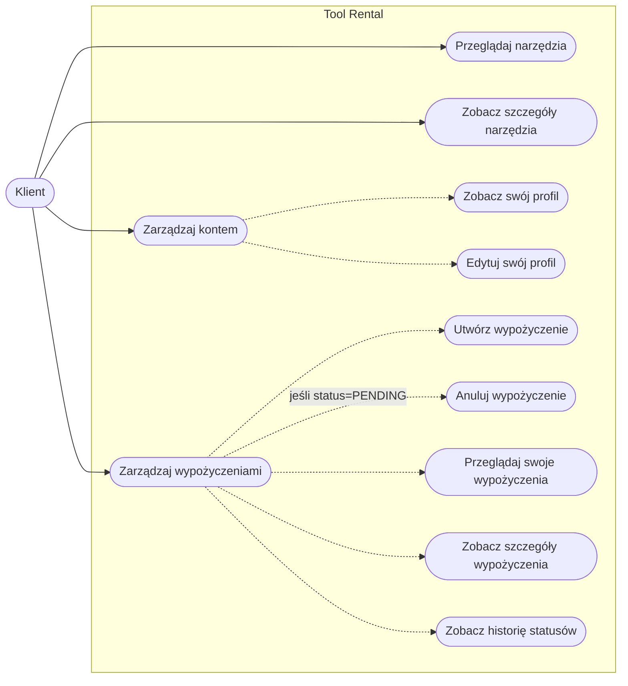

# Klient

```mermaid
flowchart LR
    customer([Klient])

    subgraph System["Tool Rental"]
        items_browse([Przeglądaj narzędzia])
        item_details([Zobacz szczegóły narzędzia])

        account_manage([Zarządzaj kontem])
        profile_view([Zobacz swój profil])
        profile_edit([Edytuj swój profil])

        rental_manage([Zarządzaj wypożyczeniami])
        rental_create([Utwórz wypożyczenie])
        rental_cancel([Anuluj wypożyczenie])
        rentals_mine([Przeglądaj swoje wypożyczenia])
        rental_details([Zobacz szczegóły wypożyczenia])
        rental_history([Zobacz historię statusów])
    end

    customer ---> items_browse
    customer ---> item_details

    customer --> account_manage
    account_manage -.-> profile_view
    account_manage -.-> profile_edit

    customer --> rental_manage
    rental_manage -.-> rental_create
    rental_manage -. "jeśli status=PENDING" .-> rental_cancel
    rental_manage -.-> rentals_mine
    rental_manage -.-> rental_details
    rental_manage -.-> rental_history
```
