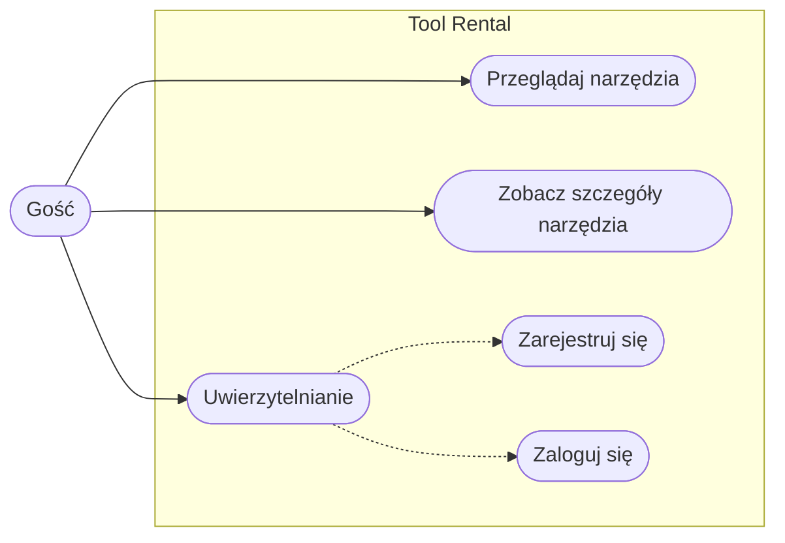

# Gość (niezalogowany)

```mermaid
flowchart LR
    guest([Gość])

    subgraph System["Tool Rental"]
        items_browse([Przeglądaj narzędzia])
        item_details([Zobacz szczegóły narzędzia])

        auth_manage([Uwierzytelnianie])
        register([Zarejestruj się])
        login([Zaloguj się])
    end

    guest ---> items_browse
    guest ---> item_details

    guest --> auth_manage
    auth_manage -.-> register
    auth_manage -.-> login
```
