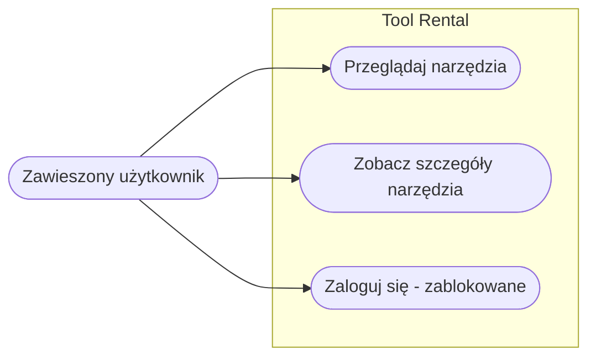

# Zawieszony użytkownik

```mermaid
flowchart LR
    suspended([Zawieszony użytkownik])

    subgraph System["Tool Rental"]
        items_browse([Przeglądaj narzędzia])
        item_details([Zobacz szczegóły narzędzia])
        login_blocked([Zaloguj się - zablokowane])
    end

    suspended --> items_browse
    suspended --> item_details
    suspended --> login_blocked
```
