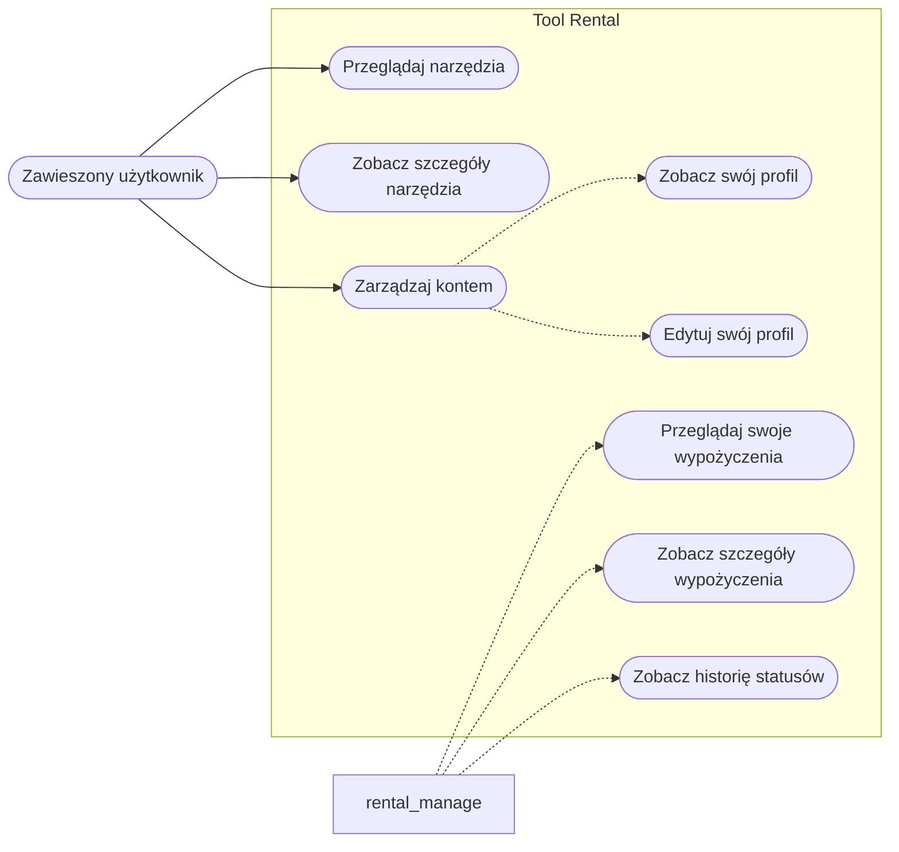

# Zawieszony użytkownik

```mermaid
flowchart LR
    suspended([Zawieszony użytkownik])

    subgraph System["Tool Rental"]
        items_browse([Przeglądaj narzędzia])
        item_details([Zobacz szczegóły narzędzia])

        account_manage([Zarządzaj kontem])
        profile_view([Zobacz swój profil])
        profile_edit([Edytuj swój profil])

        rentals_mine([Przeglądaj swoje wypożyczenia])
        rental_details([Zobacz szczegóły wypożyczenia])
        rental_history([Zobacz historię statusów])
    end

    suspended --> account_manage
    suspended --> items_browse
    suspended --> item_details
    rental_manage -.-> rentals_mine
    rental_manage -.-> rental_details
    rental_manage -.-> rental_history
    account_manage -.-> profile_view
    account_manage -.-> profile_edit
```
